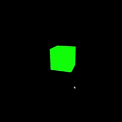

# A Guide to three.js

## Setup

There are two different ways to setup `three.js` on your system, but in this guide, we are going to be doing it via `NPM`.

### Node.js

Before we get started, make sure you have `Node.js` installed. 

If you are not sure if you have `Node.js`, you can check with the following command in your terminal:

```shell
node --version
```

If you get a version number, then, you have `Node.js` installed. if not, you will need to install it. You can find a guide to setting `Node.js` here: [Guide to set up Node.js](https://github.com/refiloemopeloa/Guides/blob/main/Web%20Development/JS/Node.js.md)

### three.js

Once you have `Node.js`, we can begin the setup for `three.js`:

You need to install three.js in the directory you'll be working from. Create a directory then open the terminal in that directory. Then we need to set our project structure.

#### Project Structure

Every `three.js` project needs at least one `HTML` file to define the webpage, and a `JavaScript` file to run your `three.js` code. The structure and naming choices below aren't required, but for the sake of consistency throughout this guide, we'll make use of them. Create a directory and add the following files:

##### index.html

The `index.html` file defines the webpage. Add the following boiler plate to your file:

```html
<!DOCTYPE html> 
<html lang="en"> 
	<head> 
		<meta charset="utf-8"> 
		<title>My first three.js app</title> 
		<style> body { margin: 0; } </style> 
	</head> 
	<body> 
		<script type="module" src="/main.js"></script> 
	</body> 
</html>
```

##### main.js

The `main.js` file is where our `three.js` code is run. For now, you only need to import the `three.js` libraries into your file:

```js
import * as THREE from 'three';
```

##### public directory

The `public` folder is sometimes also called a `static` folder. It contains files that are pushed to the website unchanged. Usually textures, audio, and 3D models will go here. 

Now that we've completed the project structure, let us begin with the setup.

#### Installation

Open your terminal in the folder where you added the above files. Then:
1. Run the following commands:
```shell
# three.js 
npm install --save three

# vite 
npm install --save-dev vite
```

##### Why Vite?

Basically, `Vite` improve the server start time by dividing the modules in an application into `dependencies` and `source code`, then serves the `source code` over `native ESM`. Without getting too technical, `Vite` reduces the time it takes for our server to start.

 When `Vite` builds your application, it sees imports for 'three' and pulls three.js files automatically from this folder.

##### Note of version history

The `node_modules` folder is used only during development, and shouldn't be uploaded to your web hosting provider or committed to version history. In other words, add it to your `ignore` file.

#### Running

To run your app, type:

```shell
npx vite
```

##### What is `npx`?

`npx` is installed with Node.js, and runs command line programs like `Vite` so that you don't have to search for the right file in `node_modules` yourself.

##### Running with `npm run dev`

If you prefer, you can put following into the `package.json:scripts` list, and use `npm run dev` instead:

```json
"scripts": { 
	"dev": "vite", // start dev server, aliases: `vite dev`, `vite serve` 
	"build": "vite build", // build for production 
	"preview": "vite preview" // locally preview production build 
}
```

##### Success?

If everything went well, you should see something like:

```shell
  VITE v5.4.8  ready in 346 ms

  ➜  Local:   http://localhost:5173/
  ➜  Network: use --host to expose
  ➜  press h + enter to show help
```

Open the local link to a blank page and, well, you've done it! Congratulations, you're now ready to make some amazing visuals.

## Cube Demo

Now that everything is in place, we can start making gorgeous visuals. We'll start by creating the scene.

### Creating a scene

The first thing you need to do in any `three.js` project is initiate three things _(mind the pun)_:

#### 1. The scene

The scene is where everything we're rendering exists. We create a scene as follows:

```js
const scene = new THREE.Scene();
```

#### 2. The camera

The camera is what "views" the scene. Things may be rendered but if they are not in the camera's viewpoint, they will not be seen. Initiate the camera as follows:

```js  
const camera = new THREE.PerspectiveCamera( 75, window.innerWidth / window.innerHeight, 0.1, 1000 );
```

There are a few different cameras in `three.js`, but we'll use the `PerspectiveCamera` for now.

##### Perspective Camera arguments

The `PerspectiveCamera` function takes the following arguments:

```js
const PerspectiveCamera = ( fov, aspect_ratio, near, far ) ={
...
};
```

* `fov`
	* `field of view` is the extent of the scene that is seen on the display at any given moment. 
	* The value is in degrees.
* `aspect_ratio`
	* You almost always want to use the width of the element divided by the height, or you'll get the same result as when you play old movies on a widescreen TV - the image looks squished.
* `near`
	* objects closer than `near` to the camera won't be rendered.
* `far`
	* objects further than `far` from the camera won't be rendered.

#### 3. The renderer

The renderer renders whatever is in the camera viewpoint. Initiate it as follows:

```js
const renderer = new THREE.WebGLRenderer(); 
renderer.setSize( window.innerWidth, window.innerHeight ); document.body.appendChild( renderer.domElement );
```

Once the renderer has been instantiated, you can set its size. The `setSize` function takes the following arguments:

```js
const setSize = ( width, height, updateStyle ) => {
...
} ; 
```

* `width`	 
	* The width to which the renderer will render
* `height`
	* The height to which the renderer will render
* `updateStyle`
	* Flag for whether renderer should shrink size of app to match resolution.
	* Boolean
	* If `false`, render at 100% width and height, but resolution should match `width` and `height`.

Lastly, we add the renderer to our HTML document so we can actually see what's happening. The renderer is a `<canvas>` element.

Bringing it all together, you should have:

```js
import * as THREE from 'three'; 

const scene = new THREE.Scene(); 

const camera = new THREE.PerspectiveCamera( 75, window.innerWidth / window.innerHeight, 0.1, 1000 ); 

const renderer = new THREE.WebGLRenderer(); renderer.setSize( window.innerWidth, window.innerHeight ); document.body.appendChild( renderer.domElement );
```

### Okay, but where's my cube?

Good question! Up until now, we've just been setting up our scene. Now, the fun part begins! Let us add our cube to the scene:

```js
const geometry = new THREE.BoxGeometry( 1, 1, 1 ); 
const material = new THREE.MeshBasicMaterial( { 
color: 0x00ff00 } 
); 
const cube = new THREE.Mesh( geometry, material ); 
scene.add( cube ); 

camera.position.z = 5;
```

Lets take a look at what each of these do:

* `BoxGeometry`
	* This is an object that contains all the points (`vertices`) and fill (`faces`) of the cube. We'll explore this more later.
* `MeshBasicMaterial`
	* In addition to the geometry, we need a material to color it. 
	* Three.js comes with several materials, but we'll stick to the `MeshBasicMaterial` for now. 
	* All materials take an object of properties which will be applied to them. 
	* To keep things very simple, we only supply a color attribute of `0x00ff00`, which is green. 
	* This works the same way that colors work in CSS (`hex colors`).
* `Mesh`
	* A mesh is an object that takes a geometry, and applies a material to it, which we then can insert to our scene, and move freely around.
* `scene.add( cube )`
	* By default, when we call `scene.add()`, the thing we add will be added to the coordinates `(0,0,0)`. 
	* This would cause both the camera and the cube to be inside each other. 
	* To avoid this, we simply move the camera out a bit.

Now, our cube is in the scene, but we haven't rendered anything yet. So, let's jump straight into rendering.

### Rendering the scene

To render, we need to create the following function and call it:

```js
function animate() {
	renderer.render( scene, camera ); 
} 
renderer.setAnimationLoop( animate );
```

This will create a loop that causes the renderer to draw the scene every time the screen is refreshed (on a typical screen this means 60 times per second). 

#### Why not use `setInterval`?

If you've designed anything with the `Canvas` API, then you know that to animate anything, we need to set some refresh interval. So why don't we for `three.js`?

The thing is - we could. However `requestAnimationFrame`, which is internally used in `WebGLRenderer`, has a number of advantages. Perhaps the most important one is that it pauses when the user navigates to another browser tab, hence not wasting their precious processing power and battery life.

#### Give it a run!

If you run your project now, you'll see a green cube on your page... well, a green square. This is because the cube is sitting in a position that we can only see one face. Let's do something about that.

### Animating the cube

Let's animate the cube by adding the following code to the `animate function`, before the `renderer.render` function is called:

```js
function animate() {
	cube.rotation.x += 0.01; 
	cube.rotation.y += 0.01;
	renderer.render( scene, camera ); 
} 
renderer.setAnimationLoop( animate );
```

Pretty, isn't it? It should look like this:



Congratulations! You've made your first `three.js` program! Now, we can do more. Like making a game 😀.
# References 

1. [three.js docs (threejs.org)](https://threejs.org/docs/index.html#manual/en/)
2. [Why Vite | Vite (vitejs.dev)](https://v3.vitejs.dev/guide/why.html)
3. [Creating a scene – three.js docs (threejs.org)](https://threejs.org/docs/#manual/en/introduction/Creating-a-scene)